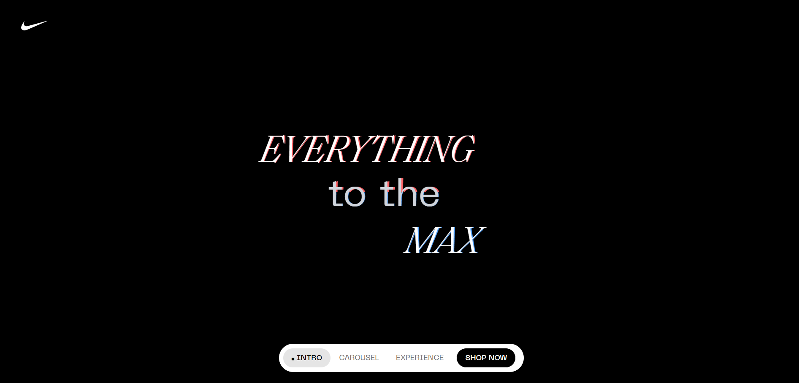
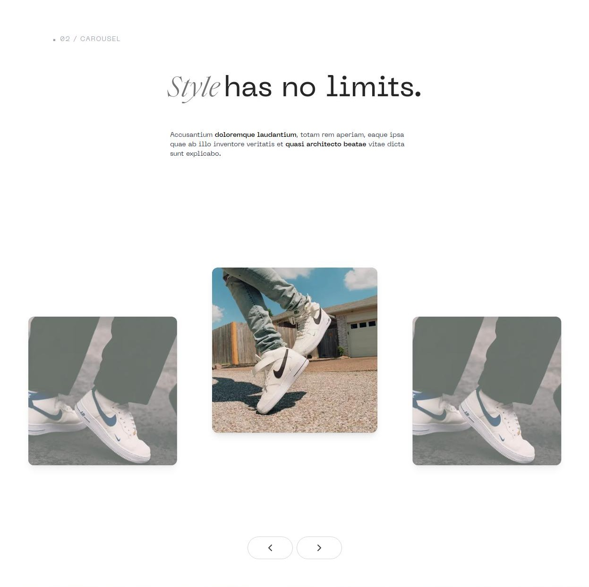
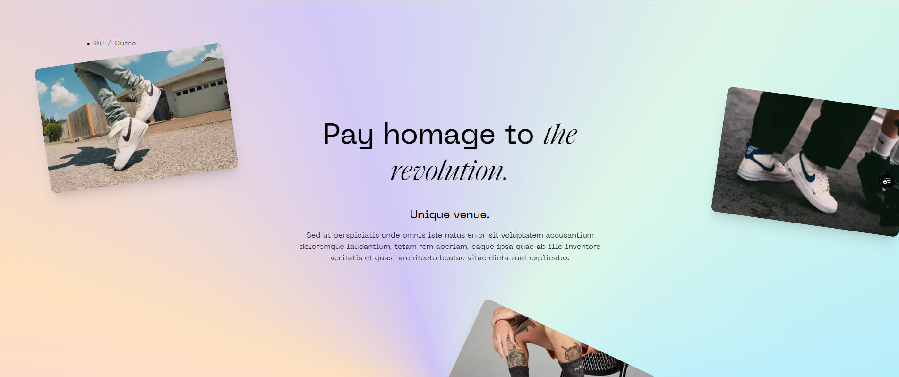
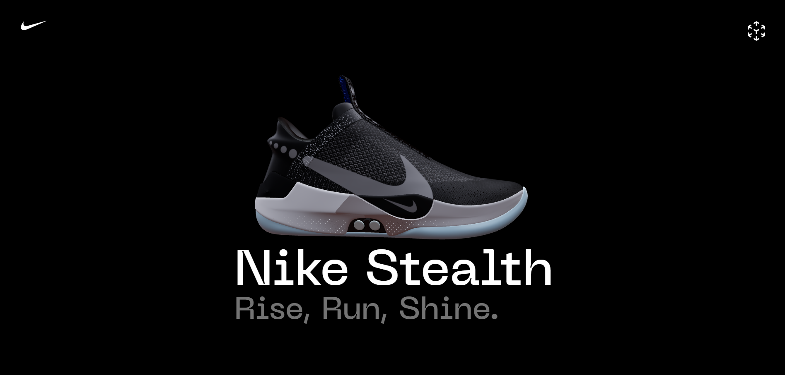
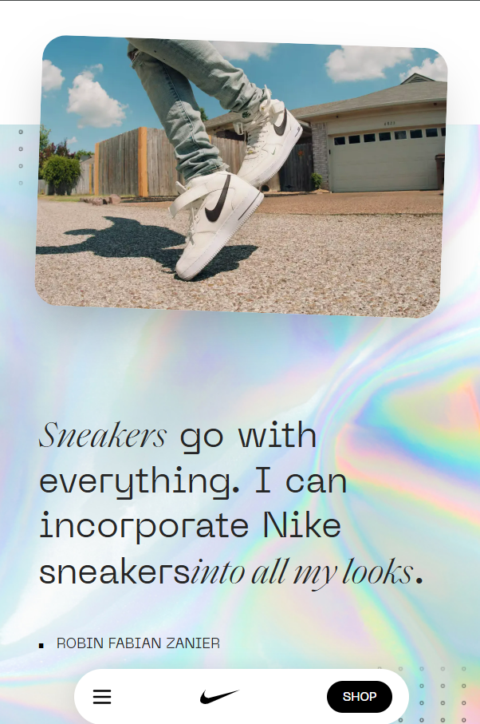

# Nike Experience Website

Un sito web moderno e interattivo per la presentazione di prodotti Nike, sviluppato con Next.js e caratterizzato da animazioni fluide, un'esperienza 3D immersiva e design responsive.


*Homepage con hero section e effetto glitch*

## 🚀 Demo Live

[Preview link here](https://nike-experience-website.vercel.app/)

## 📋 Indice

- [Caratteristiche Principali](#-caratteristiche-principali)
- [Tecnologie Utilizzate](#-tecnologie-utilizzate)
- [Struttura del Progetto](#-struttura-del-progetto)
- [Installazione](#-installazione)
- [Architettura e Scelte Tecniche](#-architettura-e-scelte-tecniche)
- [Sezioni del Sito](#-sezioni-del-sito)
- [Responsività](#-responsività)
- [Problemi Noti e Miglioramenti Futuri](#-problemi-noti-e-miglioramenti-futuri)
- [Processo di Sviluppo](#-processo-di-sviluppo)

## ✨ Caratteristiche Principali

- **Navigazione SPA**: Routing senza ricaricamento di pagina tramite Next.js App Router
- **Animazioni Fluide**: Implementate con Framer Motion e custom easing curves
- **Esperienza 3D**: Modello 3D interattivo con React Three Fiber e controlli GSAP
- **Realtà Aumentata**: Visualizzazione AR per dispositivi mobile
- **Smooth Scrolling**: Implementato con Lenis per un'esperienza di navigazione fluida
- **Slider Circolare**: Carosello custom con infinite loop
- **Design Responsive**: Ottimizzato per tutti i dispositivi
- **Gestione Dati**: Contenuti dinamici tramite file JSON statici


## 🛠 Tecnologie Utilizzate

### Core Technologies
- **Next.js 14**: Framework React con App Router

### Animazioni e Interazioni
- **Framer Motion**: Animazioni fluide e transizioni
- **Lenis**: Smooth scrolling
- **GSAP**: Animazioni del modello 3D (performance ottimizzate)

### Modello 3D 
- **React Three Fiber**: Libreria per la creazione di scene 3D

### Styling
- **Tailwind CSS**: Framework CSS utility-first
- **Custom CSS**: stili personalizzati

### Sviluppo e Versionamento
- **GitHub**: Repository
- **Vercel**: Hosting e deploy

## 📁 Struttura del Progetto

```
nike-experience-page/
├── public/
│   └── assets/
│       ├── images/
│       ├── videos/
│       └── models/
│   
├── src/
│   ├── app/
│   │   ├── experience/page.jsx
│   │   ├── shop/page.jsx
│   │   ├── global.css
│   │   ├── page.js
│   │   └── layout.js
│   │   
│   ├── components/
│   │   ├── experience/
│   │   ├── shop/
│   │   ├── homepage/
│   │   └── other components...
│   │   
│   └── assets/
│       ├── fonts/
│       └── product.json
│       
└── package.json
```

## 🚀 Installazione

### Prerequisiti
- Node.js 18 o superiore
- npm o yarn

### Setup del progetto

```bash
# Clona il repository
git clone https://github.com/viraj-perera-dev/nike-experience-page.git
cd nike-experience-page

# Installa le dipendenze
npm install
# oppure
yarn install

# Avvia il server di sviluppo
npm run dev
# oppure
yarn dev
```

Il sito sarà disponibile su [http://localhost:3000](http://localhost:3000)

## 🏗 Architettura e Scelte Tecniche

### Next.js - App Router
Ho scelto Next.js 14 con App Router per:
- **Routing automatico**: Navigazione SPA senza configurazione manuale
- **Server Components**: Miglior performance e SEO
- **File-based routing**: Struttura intuitiva e scalabile

### Framer Motion
- **Performance**: Ottimizzazioni hardware acceleration
- **Flessibilità**: Controllo granulare delle animazioni
- **Gesture support**: Drag, hover, tap nativi

### GSAP per il 3D
Per il controllo del modello 3D ho preferito GSAP a Framer Motion perché:
- **Prestazioni superiori**: Ottimizzato per animazioni complesse
- **Controllo preciso**: Timeline e tweening avanzati


## 🎨 Sezioni del Sito

### Hero Section
- **Effetto Glitch**: Animazione custom con Framer Motion
- **Video Background**


### Carosello Circolare
- **Infinite Loop**: Implementazione custom + Framer Motion



### Sezione 03 / Outro - Immagini Animate
- **Custom Easing**: Curve di animazione create con [cubic-bezier.com](https://cubic-bezier.com/)
- **Animation**: Animazione custom con Framer Motion



### Experience 3D
- **Interazione on scroll**: Rotazioni, zoom e movimenti gestiti con lo scroll trigger
- **Lighting Setup**: Illuminazione realistica
- **AR Integration**: Visualizzazione in realtà aumentata (mobile)
- **Performance Optimization**: GSAP per ottimizzazione performance




## 📱 Responsività

Il sito è completamente responsive con:
- **Breakpoints Tailwind**: sm, md, lg, xl, 2xl
- **Mobile-First**: Design ottimizzato per mobile
- **AR Support**: Realtà aumentata per dispositivi compatibili



## 🚨 Problemi e Criticità

1. **Tempo**: Progetto sviluppato principalmente nei weekend
2. **Ottimizzazioni Media**: Immagini e video non completamente ottimizzati
3. **Transizioni Navigazione**: Possibili miglioramenti nella fluidità
4. **Code Refactoring**: Necessari commenti più dettagliati e miglioramenti del codice
5. **Miglioramento SEO**: Migliorare la seo utilizzando meta tags e graphQL

## 🔄 Processo di Sviluppo

### Pianificazione
Il progetto è stato suddiviso in task giornalieri:

**Giorno 1**: Setup e Assets
- Raccolta e organizzazione assets
- Setup Next.js e configurazione base
- Struttura componenti iniziale

**Giorno 2**: Sviluppo Statico
- Implementazione layout base
- Creazione componenti UI
- Styling responsive

**Giorno 3**: Animazioni
- Integrazione Framer Motion
- Sviluppo carosello custom
- Effetti hero section

**Giorno 3/4**: Esperienza 3D
- Setup React Three Fiber
- Implementazione modello 3D
- Integrazione AR

**Giorno 4**: Rifinitura
- Testing responsive
- Ottimizzazioni finali
- Documentazione

### Metodologia
- **Mobile-First**: Sviluppo responsivo dalla base
- **Progressive Enhancement**: Funzionalità base + miglioramenti


## 🙏 Risorse

- **[react-three-fiber](https://r3f.docs.pmnd.rs/getting-started/introduction)**: Per la gestione del modello 3D
- **[convert3d](https://convert3d.org/)**: Per la conversione del modello glb in usdz (AR per dispositivi ios)
- **[framer-motion](https://www.framer.com/)**: Per la gestione delle animazioni
- **[nextjs](https://nextjs.org/)**: Framework per la creazione di siti web
- **[cubic-bezier](https://cubic-bezier.com/)**: Per la gestione delle curve personalizzate
- **[gsap](https://gsap.com/)**: Per la gestione delle animazioni
- **[lenis](https://lenis.darkroom.engineering/)**: Per la gestione dello scroll
- **[tailwind](https://tailwindcss.com/docs/installation/using-vite)**: Per la gestione dello stile e la responsività
- **[gltf to react three fiber](https://gltf.pmnd.rs/)**: Per ottenere i singoli mesh del modello 3d

